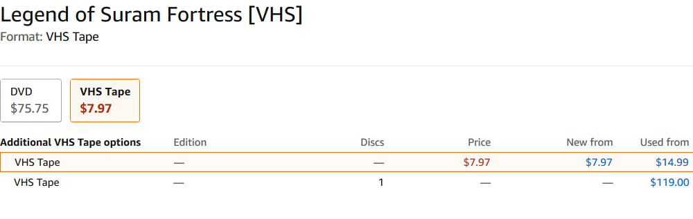
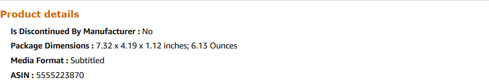
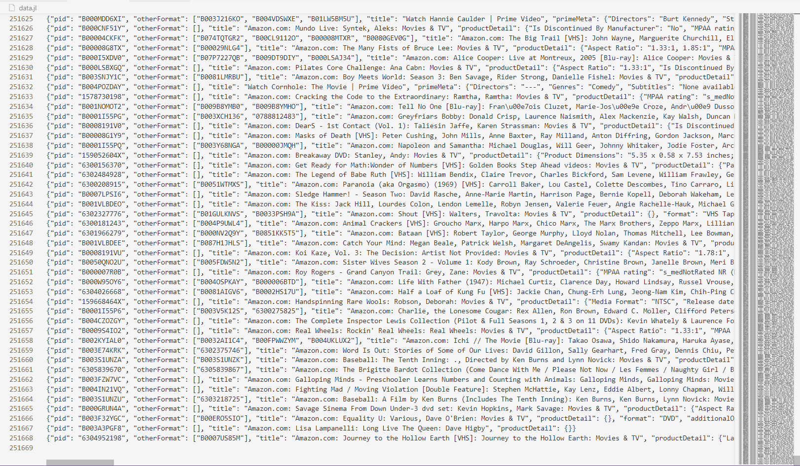
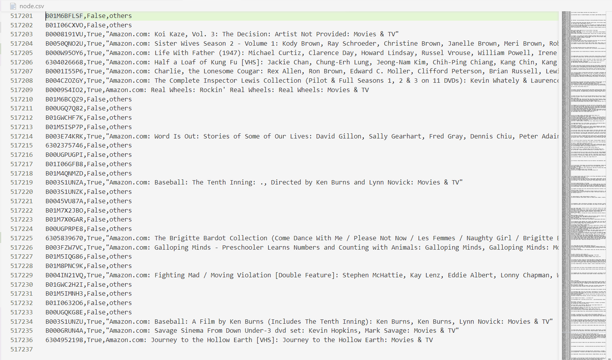
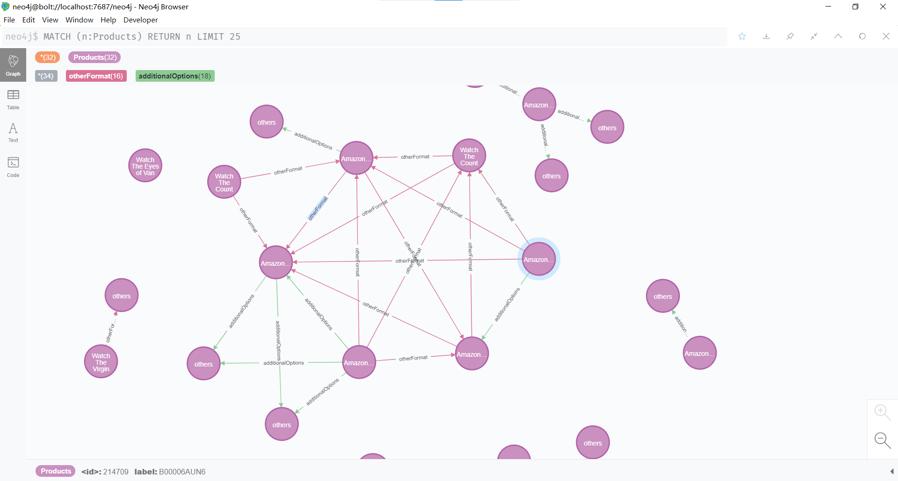
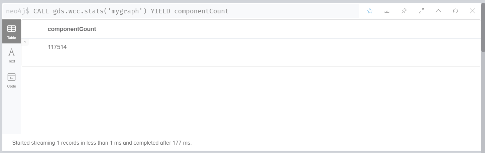

# ETL 练习报告

> 谭梓煊 (1853434)

> [Mail](2277861660@qq.com)

> 2020.10.25


[TOC]

## 一、项目概述

- 近年来, 电影、DVD、歌剧等影像作品成为了人们生活中不可或缺的休闲消遣之物, 自电影于20世纪初成规模时起, 在荧幕上出现过的影视作品数不胜数, 让想要从浩如烟海的影视作品中筛选出自己需要的内容人们也变得举步维艰. 

- 在本次练习中, 我们使用Scrapy框架爬取了25万亚马逊商品页面, 使用Python脚本进行数据清洗和处理, 筛选出约20万电影数据, 提取出电影信息和电影之间的关联, 使用neo4j图数据库存储电影节点和电影之间的同类关系, 调用neo4j内置的图算法求解**弱连通分量**个数, 最终得到不同电影的总数约为12万

- 在爬虫设计中, 我们使用ip代理池, 随机切换浏览器UA, 设置请求速度等来突破Amazon的反爬虫机制, 使用xpath和正则表达式解析爬取到的html, 存储网页解析后的数据使用 [jsonlines](https://jsonlines.org/) 格式

- 在数据处理中, 我们使用了多种判断指标来去除非电影的信息

- 最终将剩余信息按照节点和关系分别导出为CSV文件, 导入neo4j中


## 二、数据获取

### A. 亚马逊电影评论数据集(开源)

- 亚马逊电影评论数据来自SNAP发布的 [Web data: Amazon movie reviews](https://snap.stanford.edu/data/web-Movies.html) 数据集. 该数据集包含了跨度超过10年, 总数超过8百万条的亚马逊电影评论. 每条评论包括商品信息、用户信息、评分和纯文本格式的评论内容. 

- 该数据集采用纯文本格式保存, 数据格式如下：

```
product/productId: B00006HAXW
review/userId: A1RSDE90N6RSZF
review/profileName: Joseph M. Kotow
review/helpfulness: 9/9
review/score: 5.0
review/time: 1042502400
review/summary: Pittsburgh - Home of the OLDIES
review/text: I have all of the doo wop DVD's and this one is as good or better than the
1st ones. Remember once these performers are gone, we'll never get to see them again.
Rhino did an excellent job and if you like or love doo wop and Rock n Roll you'll LOVE
this DVD !!
```

- 数据集统计信息

| Catagory                       | value               |
|--------------------------------|---------------------|
| Number of reviews              | 7,911,684           |
| Number of users                | 889,176             |
| Number of products             | **253,059**         |
| Users with > 50 reviews        | 16,341              |
| Median no. of words per review | 101                 |
| Timespan                       | Aug 1997 - Oct 2012 |

### B. 亚马逊25万商品数据(爬虫)

- 在亚马逊电影评论数据集中, 提取出所有商品asin码(见下文"数据处理1")之后, 即可开始构造爬虫爬取商品数据. 
  
#### 爬虫框架

- 我们使用了Scrapy框架进行数据爬取工作

- Scrapy框架包含了从请求发送到数据解析, 存储的整套流程, 具有强大的可定制性和可拓展性, 让开发者可以从复杂的错误处理, 频率控制等操作中脱离出来, 更加关注于整体流程.

#### 反反爬虫

- 本次项目使用开源的 [ProxyBroker](https://github.com/constverum/ProxyBroker) 作为ip代理池

    - ProxyBroker可以自动收集网络上可用的ip代理, 并启动一个本地的代理服务器, 将请求转发至这些ip代理处

    

- 使用 [fake-useragent](https://github.com/hellysmile/fake-useragent) 随机生成浏览器UserAgent

    - 将fake-useragent以中间件的形式集成到Scrapy框架中

    ```python
    # @spider/amaspd/middlewares/UserAgentMiddleware.py

    from fake_useragent import UserAgent

    class UserAgentMiddleware:

        @classmethod
        def from_crawler(cls, crawler):
            # This method is used by Scrapy to create your spiders.
            return cls(crawler.settings)

        def __init__(self, settings):
            self.ua = UserAgent()

        def process_request(self, request, spider):
            request.headers['User-Agent'] = self.ua.random
    ```

    - 然后在Scrapy的settings.py中添加中间件

    ```python
    DOWNLOADER_MIDDLEWARES = {
        'amaspd.middlewares.UserAgentMiddleware.UserAgentMiddleware': 502,
    }
    ```

- 在请求头中添加一些header, 使得请求更像是浏览器发出的

    ```python
    headers = {
        'Accept': 'text/html,application/xhtml+xml,application/xml;q=0.9,*/*;q=0.8',
        'Accept-Encoding': 'gzip, deflate, br',
        'Accept-Language': 'en-US,en;q=0.9,zh-CN;q=0.8,zh;q=0.7,zh-TW;q=0.6', 
    }

    # @settings.py
    DEFAULT_REQUEST_HEADERS = {
        'Upgrade-Insecure-Requests': 1,
        'Pragma': 'no-cache',
        'Cache-Control': 'no-cache',
    }
    ```

- 禁用Cookie

    ```python
    COOKIES_ENABLED = False
    ```

- 忽略Robot.txt

    ```python
    ROBOTSTXT_OBEY = False
    ```

- 控制发送请求的速度和频率, 设置随机等待时间

    ```python
    CONCURRENT_REQUESTS = 16
    DOWNLOAD_DELAY = 0.1
    CONCURRENT_REQUESTS_PER_DOMAIN = 16
    CONCURRENT_REQUESTS_PER_IP = 16
    ```

#### 页面解析

- 在爬取过程中, 我们发现Amazon电影页面整体分为两种样式, 一种为黑色背景的Prime Video页面, 另一种为白色背景的一般商品页. 对于这两种页面我们采用了不同的解析方法.

1. 对于Prime Video页面, 我们提取了如下三处信息

    1. html文档head标签中, 具有name="title"属性的meta标签信息

    

    - 对应解析代码

    ```python
    title = response.xpath('//meta[@name="title"]/@content').extract()[0]
    ```
        
    2. 页面左侧的商品基本信息

    

    - 对应解析代码

    ```python
    primeMeta = {}
    dts = response.xpath('//div[@id="meta-info"]//dl/dt')
    for dt in dts:
        key = ''.join(dt.xpath('.//text()').extract())
        value = ''.join(dt.xpath('../dd//text()').extract())
        primeMeta[key] = value
    ```

    3. 页面底部的Other formats列表

    

    - 对应解析代码

    ```python
    otherFormat = []
    otherFormatHrefs = response.xpath('//div[@data-automation-id="other-formats"]//a/@href').extract()
    for otherFormatHref in otherFormatHrefs:
        asin = re.search('/dp/(\w+)/', otherFormatHref).group(1)
        otherFormat.append(asin)
    ```

    - 示例页面解析后的结果如下

    ```json
    {
        "pid": "B003VHELLI",
        "otherFormat": [
            "B0006OBPZY"
        ],
        "title": "Watch Colosseum - Rome's Arena of Death | Prime Video",
        "primeMeta": {
            "Starring": "Jamel Aroui, Lotfi Dziri, Derek Lea",
            "Genres": "Documentary",
            "Subtitles": "English [CC]",
            "Audio languages": "English"
        }
    }
    ```

2. 对于普通页面, 我们提取了四处信息

    1. html文档head标签中, 具有name="title"属性的meta标签信息

    

    - 对应解析代码

    ```python
    title = response.xpath('//meta[@name="title"]/@content').extract()[0]
    ```

    2. 页面顶部的Other formats列表

    3. 页面顶部的Additional options列表

    

    - 对应解析代码

    ```python
    otherFormat = []
    otherFormatHrefs = response.xpath("//li[contains(@class, 'swatchElement')]//a[@href!='javascript:void(0)']/@href").extract()
    for otherFormatHref in otherFormatHrefs:
        asin = re.search('/dp/(\w+)/', otherFormatHref).group(1)
        otherFormat.append(asin)

    additionalOptions = []
    additionalOptionHrefs = response.xpath("//div[contains(@class, 'top-level')]//span/@data-tmm-see-more-editions-click").extract()
    additionalOptionHrefs = list(filter(lambda x: '"metabindingUrl":"#"' not in x, additionalOptionHrefs))
    for additionalOptionHref in additionalOptionHrefs:
        asin = re.search('/dp/(\w+)/', additionalOptionHref).group(1)
        additionalOptions.append(asin)
    ```

    4. 页面底部的Product details

    

    - 对应解析代码

    ```python
    productDetail = {}
    detailNames = response.xpath('//div[@id="detailBullets_feature_div"]/ul[contains(@class, "detail-bullet-list")]//span[@class="a-text-bold"]')
    for detailName in detailNames:
        key = detailName.xpath('.//text()').extract()[0][:-3]
        value = detailName.xpath('../span[last()]/text()').extract()[0]
        productDetail[key] = value
    ```

    - 示例页面解析后的结果如下

    ```json
    {
        "pid": "5555223870",
        "otherFormat": [
            "B01M6BGD6N",
        ],
        "title": "Amazon.com: Legend of Suram Fortress [VHS]: Movies & TV",
        "productDetail": {
            "Is Discontinued By Manufacturer": "No",
            "Package Dimensions": "7.32 x 4.19 x 1.12 inches; 6.13 Ounces",
            "Media Format": "Subtitled",
            "ASIN": "5555223870"
        },
        "format": "VHS Tape",
        "additionalOptions": ["B00004CL4G"]
    }
    ```

#### 最终结果

- 最终爬取速度约 120 item/min, 在爬取过程中发现有 1,391 个页面已经失效, 成功爬取到 251,668 条商品数据




## 三、数据处理

### 1. 开源评论数据集 -> 商品asin码列表

- 方案: 逐行遍历movies.txt文件, 寻找开头为"product/productId:"的行, 提取后面的asin逐行写入到另一个文件中

- 注意事项: 
    - movies.txt文件编码为"iso-8859-1", 如果编码选择不正确会导致数据错乱
    - 使用集合数据结构存储已写入的asin防止重复

- 代码实现:

```python
asinSet = set()
with open("movies.txt", encoding="iso-8859-1") as movies, open('asin.txt', 'w', encoding="utf-8") as f:
    for line in movies:
        try:
            asin = line.split("product/productId:")[1].strip()
            if asin not in asinSet:
                asinSet.add(asin)
                f.write(asin+'\n')
        except:
            pass

print(f"Done. {len(asinSet)} asin in total")
```

- 输出:
```
B003AI2VGA
B00006HAXW
B00004CQT3
B00004CQT4
B006JIUN2W
B0078V2LCY
(...总计253059行, 此结果与数据集说明相符)
```

### 2. 原始商品数据 -> 电影数据

- 得到原始商品数据后, 我们首先要进行数据清洗, 将非电影的商品信息去除

#### 判断标准

- 我们采用了三种评价指标来判断一个商品是否是电影

1. 商品信息中是否出现Director属性, 如果出现则认为是电影
2. 商品信息中是否出现视频长度, 如果出现而且时长位于一定范围内则认为是电影
3. 商品信息中是否出现MPAA分级, 而且其值不为NotRated, 如果出现满足条件的分级则认为是电影

- 否则认为商品不是电影

#### 代码实现

```python
import json

dropped1 = 0
dropped2 = 0
with open('data_fixed.jl', encoding='utf-8') as f, open('movie.jl', 'w', encoding='utf-8') as fo:
    for line in f:
        jl = json.loads(line)
        if 'primeMeta' in jl:
            if 'Directors' not in jl['primeMeta']:
                dropped1 += 1
                continue
        else:
            if 'productDetail' in jl and ('Director' in jl['productDetail'] or 'Run time' in jl['productDetail'] or 'MPAA rating' in jl['productDetail'] and 's_medNotRated' not in jl['productDetail']['MPAA rating']):
                pass
            else:
                dropped2 += 1
                continue
        fo.write(line)

print(f"Drop prime video: {dropped1}")
print(f"Drop normal video: {dropped2}")
```

- 经过筛选, 最终得到了 201,368 条判断为电影的数据

### 3. 电影数据 -> 电影节点列表, 电影之间的相同关系列表

- 在数据清洗之后, 我们得到了判断为电影的商品数据, 接下来要从这些数据中提取出电影节点和电影之间的关系

#### 实现思路

1. 提取节点

    - 遍历所有电影的`otherFormat`和`additionalOptions`属性, 将未出现过的电影的asin提取出来, 和电影的名字一起逐行存储到一个csv文件中

    - 如果遇到不在最初25万商品数据集合中的节点, 则将标题设为"others"

2. 提取关系

    - 遍历所有电影的`otherFormat`和`additionalOptions`属性, 将每一条关系逐行存储到一个csv文件中

#### 运行结果

- 节点列表



- otherFormat关系列表


- additionalOptions关系列表


### 4. 节点, 关系列表 -> 图数据库

- 得到节点和关系之后, 即可导入neo4j数据库进行计算

```sql
// 导入节点
:auto USING PERIODIC COMMIT
LOAD CSV WITH HEADERS FROM "file:///node.csv" AS line
CREATE (p:Products{label:line.label,title:line.title})

// 导入otherFormat关系
:auto USING PERIODIC COMMIT
LOAD CSV WITH HEADERS FROM "file:///otherFormat.csv" AS line
MATCH (from:Products{label:line.label1}), (to:Products{label:line.label2})
MERGE (from)-[:otherFormat]-(to)

// 导入additionalOptions关系
:auto USING PERIODIC COMMIT
LOAD CSV WITH HEADERS FROM "file:///additionalOptions.csv" AS line
MATCH (from:Products{label:line.label1}), (to:Products{label:line.label2})
MERGE (from)-[:additionalOptions]-(to)
```

- 导入成功后, 即可在Neo4j Browser中看到数据库中存储的节点和节点之间的关系



- 最后调用Neo4j的图算法库

```sql
// 创建一个图
CALL gds.graph.create.cypher(
    'mygraph',
    'MATCH (n:Products) RETURN id(n) AS id',
    'MATCH (a:Products)-->(b:Products) RETURN id(a) AS source, id(b) AS target'
)
YIELD graphName, nodeCount, relationshipCount, createMillis;

// 计算wcc(弱连通分量)
CALL gds.wcc.stats('mygraph')
YIELD componentCount
```



- 即可得到最终结果, 说明在25万条商品信息中一共出现了 117,514 部不同的电影

## 四、总结

本项目中，我们通过开源数据集与Amazon网站爬取的商品数据，完整地进行了数据的获取、数据的ETL和预处理。

